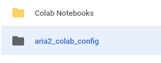
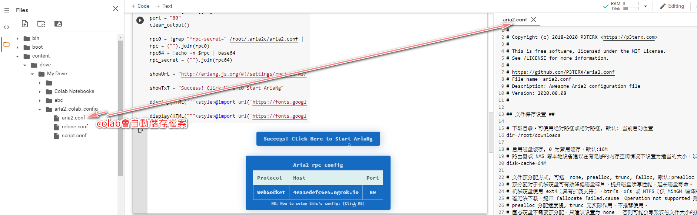
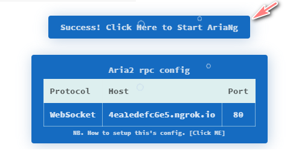
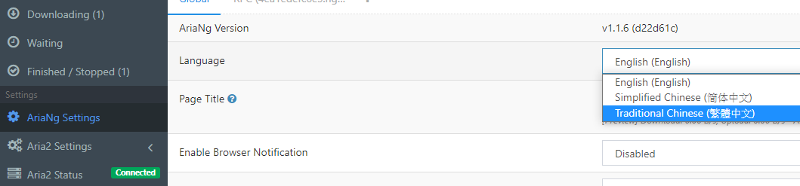
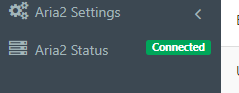

# 教學使用方法
主要是使用google dirve，在google colab中使用aira2 下載檔案完成後自動上傳到drive team (團隊盤)
* 只有小修改從drive雲端硬碟讀取配置檔案
* Rclone配置，看看這篇文章 https://p3terx.com/archives/rclone-installation-and-configuration-tutorial.html
* 配置文件
    - **aria2.conf**
        * 下載完成後自動上傳到team dirve 團隊盤
            - 自動上傳改成 `/root/.aria2c/upload.sh`
            - 不自動上傳改成 `/root/.aria2c/clean.sh`
            ```bash       
            # 此项未定义则执行 下载停止后执行的命令 (on-download-stop)
            on-download-complete=/root/.aria2c/upload.sh
            ```
    - **script.conf**
        * 修改rclone配置名稱及上傳的資料夾，查看你的rclone.conf
            ```bash
            # 网盘名称(RCLONE 配置时填写的 name)
                drive-name=gd
            # 网盘目录(上传目标目录，网盘中的文件夹路径)。注释或留空为网盘根目录，末尾不要有斜杠。
                drive-dir=/my_colab_Download/Download/
            ```
    - **rclone.conf**
        * 查看配置指令`rclone config show`，並複製貼上到`rclone.conf`

* 注意：如果關閉colab頁面，colab 12小時後會自動關閉，12小時也足夠下載檔案及上傳檔案
* colab延長使用，開啟 Developer 按下`F12`或 `Ctrl` + `shift` + `I`，選擇`Console`並輸入以下javascript，會自動去點擊 `#connect`

    ```javascript
        function ConnectButton(){
        console.log("Connect pushed"); 
        document.querySelector("#top-toolbar > colab-connect-button").shadowRoot.querySelector("#connect").click() 
    }
    setInterval(ConnectButton,60000);
    ```
    
    ```javascript
        function ConnectButton(){
        console.log("Connect pushed"); 
        document.querySelector("#ok").click() 
    }
    setInterval(ConnectButton,60000);
    ```

    如果這個點擊沒有效果，請看這篇找你要的方法 [how-to-prevent-google-colab-from-disconnecting](https://stackoverflow.com/questions/57113226/how-to-prevent-google-colab-from-disconnecting)

## 從自己的drive雲端硬碟讀取配置檔案

此部分說明一下讀取方法，在colab掛載drive，從個人drive讀取aria2_colab_config資料夾內的文件，配置檔設定好後請手動上傳aria2_colab_config資料夾，如圖



## colab上修改配置方法

colab修改檔案內容，點檔按兩下會在右邊開啟，colab會自動儲存




## 開啟AriaNg及設定

### 開啟AriNg
* 開啟AriNg網頁
    

### 切換語言

* AriaNg Setings > Language 
    

* 有Connected代表有正確連線

    


# Aria2一鍵完美配置魔改版 for Colab

小白自用學習魔改版，感謝源項目作者提供腳本。

* 源作者地址：
    * Aria2 一鍵安裝管理腳本 增強版：https://github.com/P3TERX/aria2.sh

    * OneClickRun：https://github.com/biplobsd/OneClickRun

    * aria2_colab：https://github.com/hmglife/aria2-colab

# 主要功能

調用源作者大佬一鍵安裝Aria2和ngrok內網穿透腳本，優化安裝過程，真一鍵全自動安裝

使用源作者大佬Aria2完美配置方案

優化源作者大佬開啟上傳GD方法，自行添加相關配置連結後安裝即實現下載完成全自動上傳Google Drive，完成後刪除本地文件

# 預覽


# 使用方法

1. 下載筆記本到本地，上傳到Colab，參照源作者的一鍵腳本教程配置以下文件：

    * Rclone Config：https://p3terx.com/archives/offline-download-of-onedrive-gdrive.html

    * Aria2 Config和Script Config：https://p3terx.com/archives/aria2-oneclick-installation-management-script.html

2. 配置完成並上傳到可直鏈下載的位置後（可以直接用GoIndex等目錄直鏈永久使用）輸入到筆記本對應位置，一鍵執行即可！

    PS：內網穿透建議選擇ngrok。免費token可能不穩定，建議免費註冊使用自己的token。token獲取地址：https://dashboard.ngrok.com/auth

3. 美化版主題 goindex
    * [github.com/Aicirou/goindex-theme-acrou](https://github.com/Aicirou/goindex-theme-acrou)